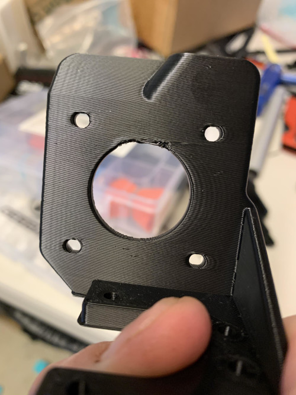
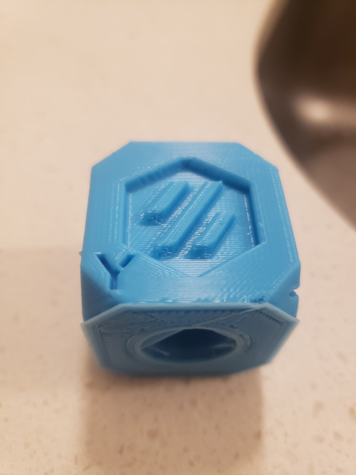
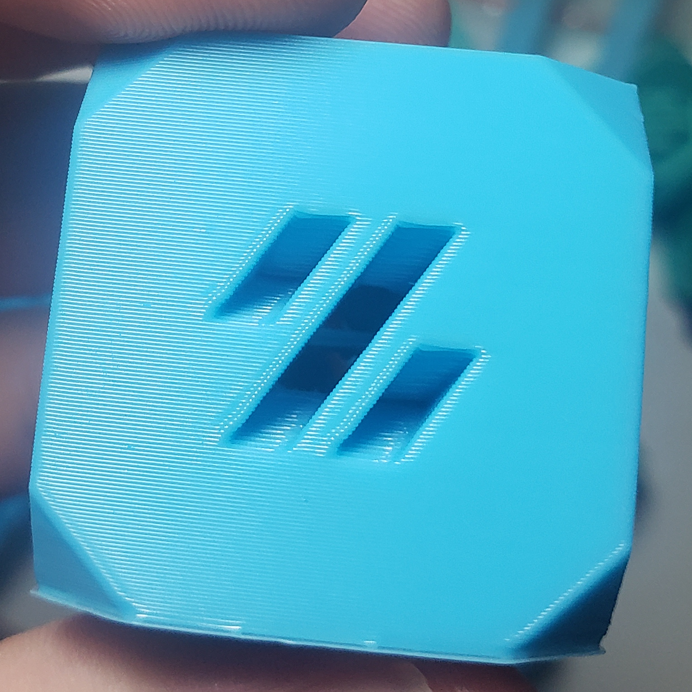
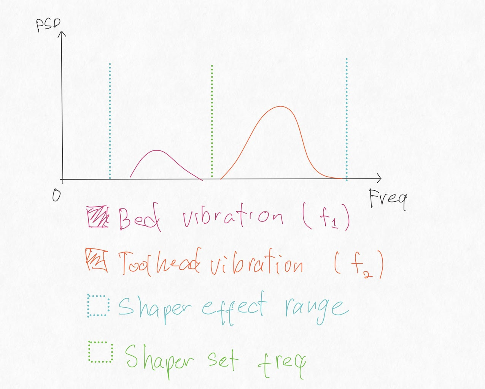

# Advance resonance tuning

## 1. Introduction

As report of some of our member, even with shaper enabled, the ringing pattern still show on printed part(check images bellow). I did some research and with the help of our member I found the solution for the ringing problem.

## 2. Source of the problem

 The acceleration sensor measure vibration of the toolhead, and apply shaper to reduce the vibration, assume that the bed is rock solid(not affect by the toolhead or the printer vibration).
 BUT if your printer is placed on unstable surface, it have soft foot, the flappy bed is only hold on one side, or like in our case, the heavy bed is held by belts and it stretch/shrink under vibration. The shaper that use solid surface as preference might not take account of the bed vibration and we have ringing pattern on the part.

## 3. The quick and dirty fix

 The easiest method is measure vibration of both the toolhead and the bed. Then force shaper to reduce the vibration of both the bed and the toolhead by manually set the shaper frequency. This is the most simple method, and it work quite well on my tests. 

※The image bellow is the Voron cube printed with 200mm/s outer wall

### 3.1. How it work

Each shaper have effective range, all vibration in that range will be reduce to certain level. We measure vibration of the toolhead and the bed, then set the value that work for both. The drawback is shaper with wide effective range like EI2 and EI3 have lower recommend max accel compare to other shaper.

### 3.2. How to setup

- Measure vibration with the ADXL345 sensor mount on the toolhead.
- Measure the vibration but with the ADXL345 sensor mount on the bed.
- Download the [calc tool html file here](https://raw.githubusercontent.com/SnakeOilXY/SnakeOil-XY/master/Software/resonance-caculator/index.html) and open it with your web browser.
- Enter the measure result into the calc tool and it will output the combined frequency that  work for both the toolhead and the bed
- Set that value to your printer config.

## 4. The better approach 

 The more effective way is measure the vibration but use the bed surface as preference point instead of the earth. I’m working on the tool to do that, if the testing going well it will available on the next few weeks. 