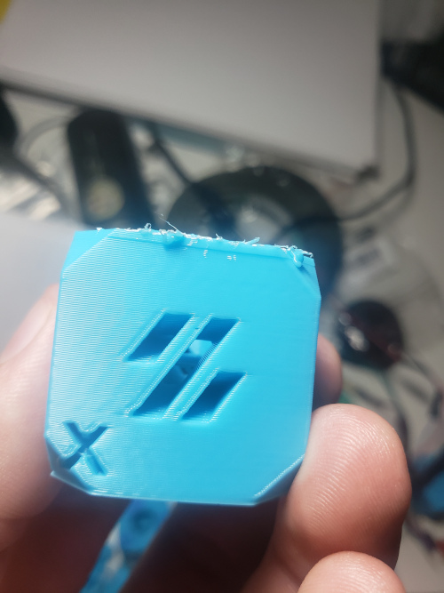
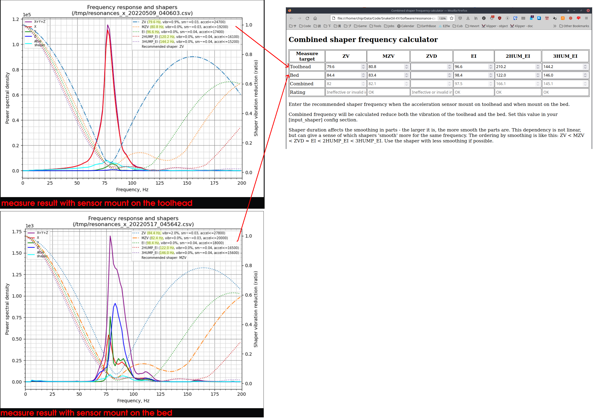

# Advance resonance tuning

## 1. Introduction

As reported by some of our members, even with an inputshaper enabled, a ringing pattern is present on printed parts(check images bellow). I did some research and with the help of our members, we found a solution to this problem.

## 2. Source of the problem

 The acceleration sensor measures vibration of the toolhead, and applies shaper to reduce the vibration but assumes that the bed is rock solid (not affected by the toolhead or the printer vibrations).
 Many things can falsify those tests: if your printer is placed on an unstable surface, has soft feet, the bed is able to vibrate or move or like in our case, the heavy bed is held by belts and they can stretch/shrink. The vibrations caused by the moving of the bed is, in our case, causing the ringing in the parts.

## 3. The quick and dirty fix

 The easiest method to eliminate the ringing: measure vibrations of both the toolhead and the bed, then force the inputshaper to reduce the vibrations of both the bed and the toolhead by manually setting the shaper frequency. This is the most simple method, and it works quite well according to our tests. 

※The image bellow is the Voron cube printed with 200mm/s outer wall

### 3.1. How it works

Each shaper has an effective range, all vibrations in that range will be reduced to a certain level. We measure the vibrations of the toolhead and the bed, then set a value that works for both. The only drawback to this method is that shapers with wide effective range like EI2 and EI3 will have lower recommended max accel value compared to other shaper.

### 3.2. How to setup

- Measure vibrations with the ADXL345 sensor mount on the toolhead.
- Measure the vibrations but with the ADXL345 sensor mount on the bed.
- Download the [calc tool html file here](https://raw.githubusercontent.com/SnakeOilXY/SnakeOil-XY/master/Software/resonance-caculator/index.html) and open it with your web browser by double clicking the htlm file.
- Enter the measured results into the calc tool and it will output the combined frequency that works for both the toolhead and the bed.
- Set that value in your printer config.

## 4. The better approach 

 The more effective way is to measure the vibrations but use the bed surface as a reference point instead of the floor on which your printer is resting. I’m working on a tool to do that, if the testing goes well it will available on the next few weeks. 